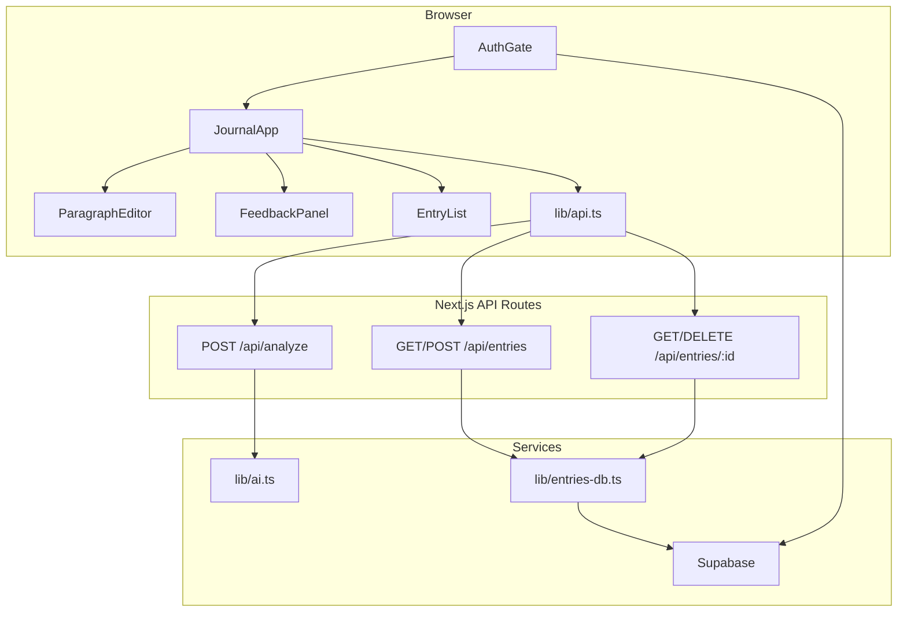

# English Journal — Technical Reference

Read this document before exploring or changing the codebase. It describes architecture, conventions, and where to look for common tasks.

## What this app does

A Next.js journaling app for English learners. Users write journal entries **paragraph by paragraph**, get **per-paragraph AI feedback** (grammar, tone, suggestions), and **save entries** to Supabase. Auth is required for persistence; analysis works without login (demo mode when no AI key is set).

## Tech stack

| Layer | Choice |
|-------|--------|
| Framework | Next.js 15 (App Router), React 19, TypeScript |
| Styling | Tailwind CSS 3 — custom palettes: `ink`, `sage`, `coral`; fonts `serif` (Literata), `sans` (DM Sans) |
| Database & auth | Supabase (Postgres + Auth + RLS) via `@supabase/ssr` |
| AI | Vercel AI SDK (`ai`) — Google Gemini (default) or OpenAI, selected by env vars |
| Validation | Zod (AI response schema in `src/lib/ai.ts`) |

## Project layout

```
src/
├── app/
│   ├── page.tsx                 # Renders <AuthGate />
│   ├── layout.tsx               # Root layout, fonts, globals
│   ├── auth/callback/route.ts   # OAuth code exchange → redirect home
│   └── api/
│       ├── analyze/route.ts     # POST — AI analysis (no auth)
│       └── entries/
│           ├── route.ts         # GET list, POST upsert (auth required)
│           └── [id]/route.ts    # GET one, DELETE (auth required)
├── components/
│   ├── AuthGate.tsx             # Session gate → AuthForm or JournalApp
│   ├── AuthForm.tsx             # Email + social sign-in
│   ├── SocialAuthButtons.tsx    # Google / Facebook OAuth
│   ├── JournalApp.tsx           # Main app shell & state orchestration
│   ├── ParagraphEditor.tsx      # Multi-block editor (text + images)
│   ├── ParagraphBlock.tsx       # Single paragraph + Check button
│   ├── ImageBlock.tsx           # Entry image preview + remove
│   ├── FeedbackPanel.tsx        # Right panel: score, tone, suggestions
│   ├── EntryList.tsx            # Left sidebar: past entries
│   ├── SuggestionCard.tsx       # One AI suggestion card
│   └── CollapsibleSection.tsx   # Expandable UI sections
├── lib/
│   ├── types.ts                 # Shared TypeScript types
│   ├── api.ts                   # Client-side fetch wrappers + ApiError
│   ├── ai.ts                    # AI provider, schema, mock analysis
│   ├── entries-db.ts            # Supabase CRUD for entries/blocks
│   ├── entry-images.ts          # Supabase Storage upload/signed URL/delete
│   ├── entry-utils.ts           # Block helpers, list-item mapping
│   ├── supabase/
│   │   ├── client.ts            # Browser Supabase client
│   │   ├── server.ts            # Server Supabase client (cookies)
│   │   └── middleware.ts        # Session refresh in middleware
│   ├── notion.ts                # LEGACY — not used; old Notion storage
│   └── mock-data.ts             # LEGACY — prototype sample data; not imported
└── middleware.ts                # Runs updateSession on all routes
supabase/schema.sql              # DB schema + RLS policies (run in Supabase SQL Editor)
```

## Architecture



### Request flow: analyze paragraph

1. User presses **Ctrl+Enter** or **Check** on a `ParagraphBlock`.
2. `JournalApp.handleAnalyzeParagraph` calls `analyzeText()` from `lib/api.ts`.
3. `POST /api/analyze` validates text (non-empty, ≤ 5000 chars).
4. If no AI API key → `getMockAnalysis()`; else `lib/ai.ts` `generateObject()` with Zod schema.
5. Result stored on the paragraph as `{ analysis, analyzedText }` in React state.
6. `FeedbackPanel` shows analysis for the **active** paragraph only.

### Request flow: save entry

1. User clicks **Save entry** → `JournalApp.handleSave` builds a `StoredJournalEntry` (client-generated UUID if new).
2. `POST /api/entries` validates payload, checks auth via `supabase.auth.getUser()`.
3. `upsertEntryForUser()` in `entries-db.ts`:
   - Updates existing entry + syncs blocks (upsert + delete removed IDs), or
   - Inserts new entry; if user has ≥ 50 entries, deletes oldest by `updated_at`.
4. Saved entry returned; sidebar refreshed via `listEntries()`.

### Auth flow

- `AuthGate` subscribes to `supabase.auth.onAuthStateChange`.
- Email: `signUp` / `signInWithPassword` in `AuthForm`.
- OAuth: `signInWithOAuth` → provider → `/auth/callback` → `exchangeCodeForSession` → redirect `/`.
- `middleware.ts` calls `updateSession()` to refresh cookies on every request.
- API routes use **server** `createClient()` and reject unauthenticated entry requests with 401.

## Data model

### Postgres (Supabase)

```
auth.users
 └── journal_entries (id, user_id, title, date, status, created_at, updated_at)
      └── journal_paragraphs (id, entry_id, order, block_type, text, analyzed_text, analysis jsonb, image_path)
storage.buckets entry-images  # private; path {user_id}/{entry_id}/{image_id}.ext
```

RLS: all policies enforce `user_id = auth.uid()` (entries) or entry ownership (paragraphs). Storage objects are scoped to the first path folder (`auth.uid()`). Schema in `supabase/schema.sql`.

`journal_paragraphs` stores an ordered list of **blocks**: `block_type = 'text'` (writing + analysis) or `'image'` (`image_path` only).

### TypeScript types (`src/lib/types.ts`)

| Type | Purpose |
|------|---------|
| `AnalysisResult` | AI output: `correctedText`, `tone`, `grammarScore`, `summary`, `suggestions[]` |
| `Suggestion` | One fix: `category`, `original`, `suggestion`, `explanation` |
| `JournalParagraph` | Text block: `type: "text"`, `id`, `text`, `analysis`, `analyzedText` |
| `JournalImageBlock` | Image block: `type: "image"`, `id`, `path` (storage path) |
| `EntryBlock` | `JournalParagraph \| JournalImageBlock` |
| `StoredJournalEntry` | Full entry for save/load: `id`, `title`, `date`, `blocks[]`, `status` |
| `JournalEntryListItem` | Sidebar summary: avg grammar score, latest tone, paragraph count |
| `JournalEntry` | **Legacy** flat shape from Notion era — avoid for new code |

### Paragraph staleness

`entry-utils.isParagraphStale()` compares `text.trim()` to `analyzedText`. If the user edits after analysis, the paragraph is stale (UI can reflect this in `ParagraphBlock`).

## API reference

| Method | Path | Auth | Body / response |
|--------|------|------|-----------------|
| `POST` | `/api/analyze` | No | `{ text }` → `{ analysis, mock }` |
| `GET` | `/api/entries` | Yes | → `{ entries: JournalEntryListItem[] }` |
| `POST` | `/api/entries` | Yes | `StoredJournalEntry` → `{ entry }` |
| `GET` | `/api/entries/:id` | Yes | → `{ entry: StoredJournalEntry }` |
| `DELETE` | `/api/entries/:id` | Yes | → `{ success: true }` |

Errors return `{ error: string }` with 4xx/5xx. Client code throws `ApiError` from `lib/api.ts`.

## Environment variables

See `.env.example`. Required for full functionality:

| Variable | Purpose |
|----------|---------|
| `NEXT_PUBLIC_SUPABASE_URL` | Supabase project URL |
| `NEXT_PUBLIC_SUPABASE_ANON_KEY` | Supabase anon key |
| `GOOGLE_GENERATIVE_AI_API_KEY` | Gemini (default provider) |
| `AI_PROVIDER` | `google` (default) or `openai` |
| `AI_MODEL` | e.g. `gemini-2.0-flash`, `gpt-4o-mini` |
| `OPENAI_API_KEY` | When `AI_PROVIDER=openai` |

Without an AI key, `/api/analyze` returns mock data (`mock: true`); UI shows a demo banner.

## UI layout

Three-column grid on large screens (`JournalApp`):

| Column | Component | Notes |
|--------|-----------|-------|
| Left (optional) | `EntryList` | Toggle via "Show past entries"; hidden by default |
| Center | Title input + `ParagraphEditor` + Save | Main writing area |
| Right | `FeedbackPanel` | Active paragraph's analysis only |

## Conventions for agents

### Git branches

When starting work on a tracked ticket or issue, branch from `main` before making changes. Full details: [`.cursor/rules/branch-naming.mdc`](.cursor/rules/branch-naming.mdc).

| Issue type | Branch pattern | Example |
|------------|----------------|---------|
| Feature, enhancement, chore | `feature/<id>-<short-slug>` | `feature/7-journal-topbar-header` |
| Bug fix | `bug/<id>-<short-slug>` | `bug/12-save-entry-missing` |

Use lowercase kebab-case for the slug (2–5 words from the ticket title). One ticket per branch.

### Do

- Keep **paragraph-level** analysis — do not merge all paragraphs into one AI call unless explicitly requested. Image blocks are not analyzed.
- Use `StoredJournalEntry` / `EntryBlock` for persistence; use `entries-db.ts` for DB access and `entry-images.ts` for Storage.
- Use `createClient()` from `supabase/server.ts` in API routes, `supabase/client.ts` in client components.
- Match existing Tailwind tokens (`ink-*`, `sage-*`, `coral-*`) and `paper-texture` class from globals.
- Run `supabase/schema.sql` when changing the DB schema; update `entries-db.ts` mappers accordingly.

### Avoid

- Wiring up `lib/notion.ts` or `lib/mock-data.ts` — legacy, unused in current app.
- Using `JournalEntry` type for new features — it's the old flat Notion shape.
- Adding auth to `/api/analyze` unless product requirements change (currently public for simpler demo).
- Storing analysis only at entry level — analysis lives on each text block’s `journal_paragraphs.analysis` JSONB column.
- Persisting signed image URLs — store `image_path` only; sign on read.

### Key constants

- `MAX_ENTRIES_PER_USER = 50` in `entries-db.ts`
- Analyze text limit: 5000 characters in `api/analyze/route.ts`
- Default title: `formatTodayDisplay()` → e.g. "Jun 24, 2026"

## Common tasks — where to change what

| Task | Files |
|------|-------|
| Change AI prompt or output shape | `src/lib/ai.ts` (also update `types.ts` + UI if schema changes) |
| Add API endpoint | `src/app/api/...`, wrapper in `src/lib/api.ts` |
| Change save/load logic | `src/lib/entries-db.ts`, `src/app/api/entries/` |
| DB schema / RLS | `supabase/schema.sql` |
| Auth providers / forms | `AuthForm.tsx`, `SocialAuthButtons.tsx`, Supabase dashboard |
| Editor behavior | `ParagraphEditor.tsx`, `ParagraphBlock.tsx`, `JournalApp.tsx` |
| Feedback UI | `FeedbackPanel.tsx`, `SuggestionCard.tsx` |
| Sidebar entries list | `EntryList.tsx`, `entry-utils.toListItem()` |

## Scripts

```bash
npm run dev      # local dev server (localhost:3000)
npm run build    # production build
npm run lint     # ESLint
```

## User-facing docs

Setup, OAuth configuration, and usage instructions are in `README.md` (human-oriented). This file is the agent-oriented technical reference.
