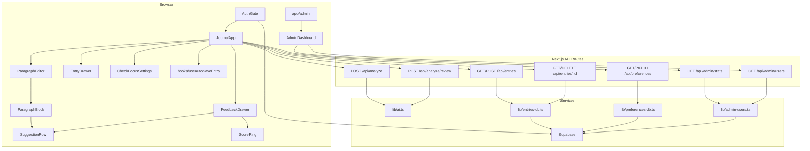

# English Journal — Technical Reference

Read this document before exploring or changing the codebase. It describes architecture, conventions, and where to look for common tasks.

## What this app does

A Next.js journaling app for English learners. Users write journal entries **paragraph by paragraph**, get **per-paragraph AI feedback** (grammar, tone, suggestions) inline under each block, request a **full-entry review** in a feedback drawer, and **save entries** to Supabase. Users can customize **check focus** — which areas AI reviews (grammar, spelling, tone, etc.) and an optional learning goal — persisted per account. Auth is required for persistence and preferences; analysis works without login (demo mode when no AI key is set, using default focus areas).

## Tech stack

| Layer | Choice |
|-------|--------|
| Framework | Next.js 15 (App Router), React 19, TypeScript |
| Styling | Tailwind CSS 3 — palettes: `ink`, `sage`, `coral`, `pen`; fonts `display` (Fraunces), `sans` / `mono` (Courier Prime) |
| Database & auth | Supabase (Postgres + Auth + RLS) via `@supabase/ssr` |
| AI | Vercel AI SDK (`ai`) — Google Gemini (default) or OpenAI, selected by env vars |
| Validation | Zod (AI response schema in `src/lib/ai.ts`; preferences schema in `src/lib/analysis-preferences.ts`) |

## Project layout

```
src/
├── app/
│   ├── page.tsx                    # Renders <AuthGate />
│   ├── layout.tsx                  # Root layout, fonts, globals
│   ├── admin/page.tsx              # Admin dashboard (ADMIN_EMAILS gate)
│   ├── auth/callback/route.ts      # OAuth code exchange → redirect home
│   └── api/
│       ├── analyze/
│       │   ├── route.ts            # POST — per-paragraph AI analysis (no auth)
│       │   └── review/route.ts     # POST — full-entry review (no auth)
│       ├── entries/
│       │   ├── route.ts            # GET list, POST upsert (auth required)
│       │   └── [id]/route.ts       # GET one, DELETE (auth required)
│       ├── preferences/
│       │   └── route.ts            # GET/PATCH — analysis preferences (auth required)
│       └── admin/
│           ├── stats/route.ts      # GET auth stats (admin only)
│           └── users/route.ts      # GET paginated user list (admin only)
├── components/
│   ├── AuthGate.tsx                # Session gate → AuthForm or JournalApp
│   ├── AuthForm.tsx                # Email + social sign-in
│   ├── SocialAuthButtons.tsx       # Google / Facebook OAuth
│   ├── JournalApp.tsx              # Main app shell & state orchestration
│   ├── ParagraphEditor.tsx         # Multi-block editor (text + images)
│   ├── ParagraphBlock.tsx          # Single paragraph + Check + inline notes
│   ├── ImageBlock.tsx              # Entry image preview + remove
│   ├── EntryDrawer.tsx             # Past entries overlay (left)
│   ├── FeedbackDrawer.tsx          # Full-entry review overlay (right)
│   ├── CheckFocusSettings.tsx      # Check focus overlay (focus areas + learning goal)
│   ├── SuggestionRow.tsx           # Collapsible suggestion row
│   ├── ScoreRing.tsx               # Grammar score ring (0–10 display)
│   └── AdminDashboard.tsx          # Admin stats + user table
├── hooks/
│   └── useAutoSaveEntry.ts         # Debounced auto-save (10s), flush, dirty tracking
├── lib/
│   ├── types.ts                    # Shared TypeScript types
│   ├── api.ts                      # Client-side fetch wrappers + ApiError
│   ├── ai.ts                       # AI provider, schema, mock analysis
│   ├── analysis-preferences.ts     # Focus-area constants, Zod schema, defaults
│   ├── preferences-db.ts           # Supabase CRUD for user_preferences
│   ├── entries-db.ts               # Supabase CRUD for entries/blocks
│   ├── entry-images.ts             # Supabase Storage upload/signed URL/delete
│   ├── entry-utils.ts              # Block helpers, list-item mapping, month groups
│   ├── admin-auth.ts               # requireAdmin(), ADMIN_EMAILS parsing
│   ├── admin-users.ts              # Supabase Admin API: list users, stats
│   └── supabase/
│       ├── client.ts               # Browser Supabase client
│       ├── server.ts               # Server Supabase client (cookies)
│       ├── admin.ts                # Service-role Supabase client
│       └── middleware.ts           # Session refresh in middleware
└── middleware.ts                   # Runs updateSession on all routes
supabase/schema.sql                 # DB schema + RLS policies (run in Supabase SQL Editor)
```

## Architecture



### Request flow: analyze paragraph

1. User presses **Ctrl+Enter** or **Check** on a `ParagraphBlock`.
2. `JournalApp.handleAnalyzeParagraph` calls `analyzeText(text, analysisPreferences)` from `lib/api.ts`.
3. `POST /api/analyze` validates text (non-empty, ≤ 5000 chars) and optional `preferences` (defaults to all focus areas).
4. If no AI API key → `getMockAnalysis()`; else `lib/ai.ts` `generateObject()` with Zod schema. Prompts and post-filtering respect `preferences.focusAreas` and `preferences.customNote`.
5. Result stored on the paragraph as `{ analysis, analyzedText }` in React state.
6. Inline `SuggestionRow` components under the paragraph show suggestions; stale edits are flagged via `isParagraphStale()`.

### Request flow: full-entry review

1. User opens the **Feedback** drawer from the topbar.
2. `JournalApp` calls `analyzeEntryReview()` with all text blocks joined and current `analysisPreferences`.
3. `POST /api/analyze/review` validates text (non-empty, ≤ 20,000 chars) and optional `preferences`.
4. If no AI API key → `getMockEntryReview()`; else `reviewEntry()` in `lib/ai.ts`.
5. `FeedbackDrawer` shows score (`ScoreRing`), tone, summary, polished version, focus summary, and `SuggestionRow` list.

The topbar feedback badge counts **paragraph-level** `suggestions.length`, not entry-review suggestions.

### Request flow: check focus preferences

1. On sign-in, `JournalApp` calls `fetchPreferences()` → `GET /api/preferences`.
2. `getPreferencesForUser()` in `preferences-db.ts` returns existing row or inserts defaults (`DEFAULT_ANALYSIS_PREFERENCES` from `analysis-preferences.ts`).
3. User opens **Check focus** from the topbar → `CheckFocusSettings` overlay.
4. User toggles focus areas (at least one required) and optionally sets a learning goal (≤ 300 chars).
5. Save calls `savePreferences()` → `PATCH /api/preferences` → `upsertPreferencesForUser()`.
6. Updated preferences are passed to subsequent paragraph checks and entry reviews.

### Request flow: save entry

1. Edits to title or blocks trigger debounced auto-save (10s) via `useAutoSaveEntry` in `JournalApp`; user can also click **Save** for an immediate write.
2. Both paths build a `StoredJournalEntry` (client-generated UUID for new entries) and call `POST /api/entries`.
3. `upsertEntryForUser()` in `entries-db.ts`:
   - Updates existing entry + syncs blocks (upsert + delete removed IDs), or
   - Inserts new entry; if user has ≥ 50 entries, deletes oldest by `updated_at`.
4. Saved entry returned; entries list refreshes on manual save, when the entries drawer opens, or on a debounced timer after auto-save.
5. `flush()` runs before switching entries to avoid losing unsaved edits; `beforeunload` warns when dirty.

### Auth flow

- `AuthGate` subscribes to `supabase.auth.onAuthStateChange`.
- Email: `signUp` / `signInWithPassword` in `AuthForm`.
- OAuth: `signInWithOAuth` → provider → `/auth/callback` → `exchangeCodeForSession` → redirect `/`.
- `middleware.ts` calls `updateSession()` to refresh cookies on every request.
- API routes use **server** `createClient()` and reject unauthenticated entry and preferences requests with 401.

### Admin flow

- `/admin` page checks session + `ADMIN_EMAILS` via `isAdminEmail()`; redirects non-admins home.
- `AdminDashboard` fetches `GET /api/admin/stats` and `GET /api/admin/users` (paginated, sortable).
- Admin routes use `requireAdmin()` and `lib/supabase/admin.ts` (service role key).

## Data model

### Postgres (Supabase)

```
auth.users
 ├── journal_entries (id, user_id, title, date, status, created_at, updated_at)
 │    └── journal_paragraphs (id, entry_id, order, block_type, text, analyzed_text, analysis jsonb, image_path)
 └── user_preferences (user_id, analysis_preferences jsonb, created_at, updated_at)
storage.buckets entry-images  # private; path {user_id}/{entry_id}/{image_id}.ext
```

RLS: all policies enforce `user_id = auth.uid()` (entries, preferences) or entry ownership (paragraphs). Storage objects are scoped to the first path folder (`auth.uid()`). Schema in `supabase/schema.sql`.

`journal_paragraphs` stores an ordered list of **blocks**: `block_type = 'text'` (writing + analysis) or `'image'` (`image_path` only).

`user_preferences.analysis_preferences` stores `{ focusAreas: string[], customNote?: string }`. Defaults to all six focus areas when missing or invalid.

### TypeScript types (`src/lib/types.ts`)

| Type | Purpose |
|------|---------|
| `SuggestionCategory` | Focus area enum: `grammar`, `spelling`, `tone`, `word-choice`, `naturalness`, `punctuation` |
| `AnalysisFocusArea` | Alias of `SuggestionCategory` |
| `AnalysisPreferences` | User check focus: `focusAreas[]`, optional `customNote` (≤ 300 chars) |
| `AnalysisResult` | AI output: `correctedText`, `tone`, `grammarScore`, `summary`, `suggestions[]` |
| `EntryReviewResult` | Alias of `AnalysisResult` for full-entry review |
| `Suggestion` | One fix: `category` (`SuggestionCategory`), `original`, `suggestion`, `explanation` |
| `JournalParagraph` | Text block: `type: "text"`, `id`, `text`, `analysis`, `analyzedText` |
| `JournalImageBlock` | Image block: `type: "image"`, `id`, `path` (storage path) |
| `EntryBlock` | `JournalParagraph \| JournalImageBlock` |
| `StoredJournalEntry` | Full entry for save/load: `id`, `title`, `date`, `blocks[]`, `status` |
| `JournalEntryListItem` | Drawer summary: avg grammar score, latest tone, paragraph count |
| `AdminStats` | User signup and activity counts |
| `AdminUserRow` | One row in admin user table |
| `AdminUsersResponse` | Paginated user list + total count |

### Paragraph staleness

`entry-utils.isParagraphStale()` compares `text.trim()` to `analyzedText`. If the user edits after analysis, the paragraph is stale (UI reflects this in `ParagraphBlock`).

### Grammar score display

Scores are stored 0–100 in the DB and AI schema. `ScoreRing.scoreToDisplay()` converts to a 0–10 scale for UI.

## API reference

| Method | Path | Auth | Body / response |
|--------|------|------|-----------------|
| `POST` | `/api/analyze` | No | `{ text, preferences? }` → `{ analysis, mock }` |
| `POST` | `/api/analyze/review` | No | `{ text, preferences? }` → `{ review, mock }` |
| `GET` | `/api/preferences` | Yes | → `{ preferences: AnalysisPreferences }` |
| `PATCH` | `/api/preferences` | Yes | `AnalysisPreferences` → `{ preferences: AnalysisPreferences }` |
| `GET` | `/api/entries` | Yes | → `{ entries: JournalEntryListItem[] }` |
| `POST` | `/api/entries` | Yes | `StoredJournalEntry` → `{ entry }` |
| `GET` | `/api/entries/:id` | Yes | → `{ entry: StoredJournalEntry }` |
| `DELETE` | `/api/entries/:id` | Yes | → `{ success: true }` |
| `GET` | `/api/admin/stats` | Admin | → `AdminStats` |
| `GET` | `/api/admin/users` | Admin | `?page&limit&sort&order` → `AdminUsersResponse` |

Client wrappers in `lib/api.ts`: `analyzeText`, `analyzeEntryReview`, `fetchPreferences`, `savePreferences`, `listEntries`, `fetchEntry`, `saveEntry`, `deleteEntry`, `fetchAdminStats`, `fetchAdminUsers`.

Errors return `{ error: string }` with 4xx/5xx. Client code throws `ApiError` from `lib/api.ts`.

## Environment variables

See `.env.example`. Required for full functionality:

| Variable | Purpose |
|----------|---------|
| `NEXT_PUBLIC_SUPABASE_URL` | Supabase project URL |
| `NEXT_PUBLIC_SUPABASE_ANON_KEY` | Supabase anon key |
| `GOOGLE_GENERATIVE_AI_API_KEY` | Gemini (default provider) |
| `AI_PROVIDER` | `google` (default) or `openai` |
| `AI_MODEL` | e.g. `gemini-2.0-flash`, `gpt-4o-mini` |
| `OPENAI_API_KEY` | When `AI_PROVIDER=openai` |
| `SUPABASE_SERVICE_ROLE_KEY` | Server-only; admin dashboard user queries |
| `ADMIN_EMAILS` | Comma-separated emails allowed to access `/admin` |

Without an AI key, `/api/analyze` and `/api/analyze/review` return mock data (`mock: true`); UI shows a demo banner.

## UI layout

Centered single-column editor (`max-w-sheet`) with a sticky topbar and overlay drawers on large and small screens (`JournalApp`):

| Area | Component | Notes |
|------|-----------|-------|
| Topbar | `JournalApp` | Entries toggle, Feedback toggle (badge = inline note count), Check focus, Save status, sign out |
| Center | Title + `ParagraphEditor` | Main writing area; per-paragraph feedback inline; active block shows focus summary |
| Left overlay | `EntryDrawer` | Past entries grouped by month; new entry, refresh, delete |
| Right overlay | `FeedbackDrawer` | Full-entry AI review on demand; shows current focus summary |
| Overlay | `CheckFocusSettings` | Focus-area toggles + optional learning goal |

Key CSS utilities in `globals.css`: `.topbar`, `.feedback-btn`, `.pen`, `.lnk`, `.writing-dim`, `body.drawer-open` (scroll lock when entries, feedback, or check-focus overlay is open).

## Conventions for agents

### Git branches

When starting work on a tracked ticket or issue, branch from `main` before making changes. Full details: [`.cursor/rules/branch-naming.mdc`](.cursor/rules/branch-naming.mdc).

| Issue type | Branch pattern | Example |
|------------|----------------|---------|
| Feature, enhancement, chore | `feature/<id>-<short-slug>` | `feature/7-journal-topbar-header` |
| Bug fix | `bug/<id>-<short-slug>` | `bug/12-save-entry-missing` |

Use lowercase kebab-case for the slug (2–5 words from the ticket title). One ticket per branch.

### Do

- Keep **paragraph-level** analysis — do not merge all paragraphs into one AI call unless explicitly requested. Image blocks are not analyzed.
- Use `StoredJournalEntry` / `EntryBlock` for persistence; use `entries-db.ts` for DB access and `entry-images.ts` for Storage.
- Use `createClient()` from `supabase/server.ts` in API routes, `supabase/client.ts` in client components.
- Match existing Tailwind tokens (`ink-*`, `sage-*`, `coral-*`, `pen-*`) and `paper-texture` class from globals.
- Run `supabase/schema.sql` when changing the DB schema; update `entries-db.ts` or `preferences-db.ts` mappers accordingly.
- Pass `analysisPreferences` from `JournalApp` through to analyze API calls; filter suggestions server-side in `ai.ts` via `filterSuggestions()`.

### Avoid

- Adding auth to `/api/analyze` or `/api/analyze/review` unless product requirements change (currently public for simpler demo; preferences are optional in the request body).
- Storing analysis only at entry level — analysis lives on each text block’s `journal_paragraphs.analysis` JSONB column.
- Persisting signed image URLs — store `image_path` only; sign on read.
- Exposing `SUPABASE_SERVICE_ROLE_KEY` to the client (no `NEXT_PUBLIC_` prefix).

### Key constants

- `MAX_ENTRIES_PER_USER = 50` in `entries-db.ts`
- Analyze text limit: 5000 characters in `api/analyze/route.ts`
- Entry review limit: 20,000 characters in `api/analyze/review/route.ts`
- Learning goal (`customNote`) limit: 300 characters in `analysis-preferences.ts`
- Auto-save debounce: 10 seconds in `hooks/useAutoSaveEntry.ts`
- Default title: `formatTodayDisplay()` → e.g. "Jun 24, 2026"
- Default focus areas: all six categories in `DEFAULT_ANALYSIS_PREFERENCES` (`analysis-preferences.ts`)

## Common tasks — where to change what

| Task | Files |
|------|-------|
| Change AI prompt or output shape | `src/lib/ai.ts` (also update `types.ts` + UI if schema changes) |
| Check focus / analysis preferences | `CheckFocusSettings.tsx`, `analysis-preferences.ts`, `preferences-db.ts`, `app/api/preferences/`, `JournalApp.tsx`, `ai.ts` |
| Add API endpoint | `src/app/api/...`, wrapper in `src/lib/api.ts` |
| Change save/load logic | `src/lib/entries-db.ts`, `src/app/api/entries/` |
| DB schema / RLS | `supabase/schema.sql` |
| Auth providers / forms | `AuthForm.tsx`, `SocialAuthButtons.tsx`, Supabase dashboard |
| Editor behavior | `ParagraphEditor.tsx`, `ParagraphBlock.tsx`, `JournalApp.tsx`, `hooks/useAutoSaveEntry.ts` |
| Inline paragraph feedback | `ParagraphBlock.tsx`, `SuggestionRow.tsx` |
| Full-entry review drawer | `FeedbackDrawer.tsx`, `ScoreRing.tsx`, `JournalApp.tsx` |
| Entries drawer | `EntryDrawer.tsx`, `entry-utils.groupEntriesByMonth()`, `entry-utils.toListItem()` |
| Admin dashboard | `AdminDashboard.tsx`, `lib/admin-auth.ts`, `lib/admin-users.ts`, `app/api/admin/` |

## Scripts

```bash
npm run dev      # local dev server (localhost:3000)
npm run build    # production build
npm run lint     # ESLint
```

## User-facing docs

Setup, OAuth configuration, and usage instructions are in `README.md` (human-oriented). This file is the agent-oriented technical reference.
